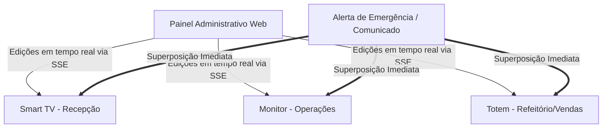

# 🖥️ TelaHub — A Revolução em Comunicação Visual & Displays Corporativos

> **Transforme qualquer tela em um painel interativo, inteligente e dinâmico em tempo real.**

---

## 🎯 O que é o TelaHub?

O **TelaHub** é um ecossistema *premium* de gestão de telas digitais (Digital Signage). Ele permite que sua empresa controle, organize e transmita conteúdos interativos para Smart TVs, tablets, totens e monitores espalhados pelo escritório, refeitório ou PDV — tudo controlado a partir de um painel administrativo centralizado, moderno e extremamente simples de usar.

---

## 💎 Os 4 Pilares da Experiência TelaHub

### 1. ⚡ Atualização Instantânea (Sem Refresh!)
Graças à tecnologia **SSE (Server-Sent Events)**, qualquer alteração feita no painel reflete na TV **instantaneamente**. Chega de recarregar páginas ou ver telas piscando em branco. É fluido, profissional e imediato.

### 2. 🎨 Design Premium & Efeitos Visuais
Suas telas não precisam ser estáticas e sem graça. O TelaHub conta com:
*   **Efeito Glassmorphism:** Elementos elegantes e translúcidos com visual de vidro fosco.
*   **Fundos Dinâmicos:** Animações sutis como o efeito Aurora Boreal, chuva, neve e gradientes em constante movimento que chamam a atenção do público.
*   **Micro-Animações:** Textos com efeitos máquina de escrever, fade, slide ou pulsação.

### 3. 🖱️ Editor Inteligente Arrastar-e-Soltar
Crie layouts profissionais em segundos. Com o nosso editor modular dinâmico, você define a posição, o tamanho e o tempo de exibição de cada widget de forma 100% visual.

### 4. ⚙️ Performance Ultra-Leve & Inteligente
*   **Economia de Banda (96% de redução):** Se a conexão cair, o sistema entra em *polling* inteligente automático.
*   **Cache Inteligente (ETag):** O display só baixa novos dados se houver alterações reais no servidor, poupando a rede da sua empresa.

---

## 🔌 Super Catálogo de Widgets (Funcionalidades)

Organize suas telas utilizando o melhor conjunto de blocos interativos do mercado, divididos para atender todas as necessidades do seu negócio:

### 🖼️ 1. Mídia & Engajamento Visual
*   **Texto Animado:** Comunicados impactantes com animações de digitação (*typewriter*), *fade* ou *bounce*.
*   **Galeria de Imagens & GIFs:** Exibição perfeita de fotos, banners promocionais e GIFs animados.
*   **Vídeo Player Premium:** Suporte a uploads locais ou integração direta com o YouTube (com autoplay, loop e mute).
*   **Painel Info Geral:** Data, hora, saudação e status unificados em um só lugar.

### 📅 2. Produtividade & Cultura Organizacional
*   **Notas Adesivas (Post-its):** Lembretes e recados com temas neon, *glass* ou clássicos.
*   **Lista de Tarefas Reativa:** Acompanhe o progresso de entregas da equipe com barra de progresso visual colorida.
*   **Contagem Regressiva:** Gere senso de urgência ou celebração para metas, eventos ou prazos de projetos.
*   **Quadro de Deveres (Escala):** Atribuição clara de responsáveis e tarefas da semana.
*   **Cardápio Semanal Dinâmico:** Apresentação elegante das refeições do refeitório com navegação em slides de fácil leitura.

### 📈 3. Decisões Baseadas em Dados (Finanças & Clima)
*   **Previsão do Tempo Ao Vivo:** Layouts que se adaptam automaticamente ao clima atual de qualquer cidade escolhida.
*   **Radar do Mercado (Cotações & Cripto):** Acompanhe ações (ex: PETR4, AAPL) ou criptomoedas com minigráficos (*sparklines*) e setas dinâmicas de oscilação de preço.
*   **Notícias em Tempo Real (RSS):** Mantenha sua equipe informada com letreiros de notícias estilo jornal ou colunas com fotos.

### 🔗 4. Integrações Corporativas Seguras (Embeds)
Integre os sistemas que sua empresa já usa de forma segura e sem complicação técnica:
*   **Dashboards Power BI:** Seus KPIs e relatórios atualizados e visíveis para os tomadores de decisão.
*   **Planilhas & Docs (Google / Microsoft):** Projete relatórios do Excel/Word ou Google Docs/Sheets atualizados automaticamente na nuvem.
*   **Airtable & PDFs:** Visualização perfeita de bases de dados ou manuais corporativos.
*   **Navegador Simulado (Snapshot):** Capturas periódicas automáticas de qualquer página web interna ou externa.
*   **HTML Customizado:** Liberdade total para os desenvolvedores criarem soluções exclusivas e customizadas diretamente na tela.

---

## 🚀 Diferenciais de Negócio (Por que escolher o TelaHub?)

| Benefício | O Problema Comum | A Solução TelaHub |
| :--- | :--- | :--- |
| **Atualização** | Precisar ir até a TV com pendrive ou teclado para atualizar o slide. | Controle remoto e instantâneo via painel web em tempo real. |
| **Integração** | Sistemas de TV corporativa fechados que não conversam com o Power BI. | Integração nativa com Power BI, Google, Microsoft e APIs de mercado. |
| **Visual** | Telas estáticas, travadas e com design antigo (anos 2000). | Design moderno com transparência *Glassmorphism* e fundos animados fluidos. |
| **Estabilidade** | Se a internet oscilar, a TV exibe uma tela de erro do navegador. | Sistema resiliente com cache local e *fallback* inteligente offline. |

---

> **TelaHub:** A informação certa, no lugar certo, com o visual que a sua empresa merece.
